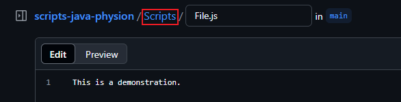

# When contributing:
-  Create content for the good of the community.
-  Do not post unrelated content.
-  Send requests to the pull request tab. If you send a request to discussions, it will probably not get added.
-  If you are contributing a script, please update the table on the README.
-  If possible, include your data in all language files.
> [!TIP]
> When adding a file, make sure to include the [Scripts] directory.
> 
