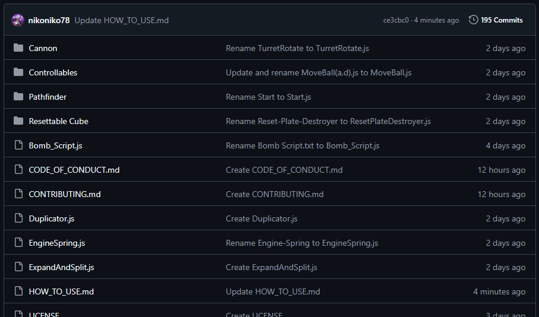
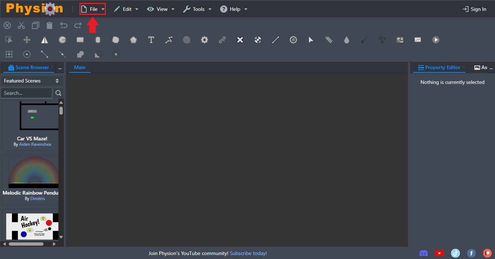
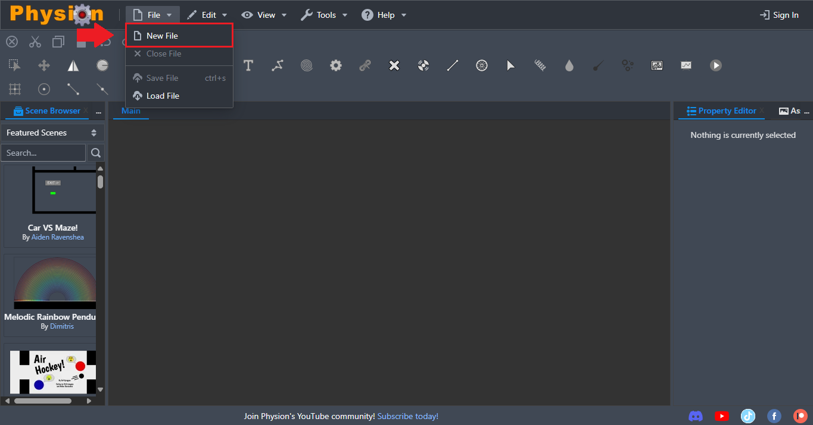

> [!NOTE]
> This tutorial assumes you are using th default layout setup.
# How to implement a script on Physion:
## Select the Scripts folder.

## Select a script.

## Copy raw file.

## Go to app.physion.net.

## Create a new scene.
### 1.

### 2.

## Open the Assets Library.
### 1.

### 2.

## Create a Javascript asset.
### 1.

### 2.

## Paste raw file.

## Apply script.

## Close the Assets Library.

## Apply script to node.
### 1.

### 2.

### 3.

