# How to implement a script on Physion:
### Select the Scripts folder.

### Select your script.
| 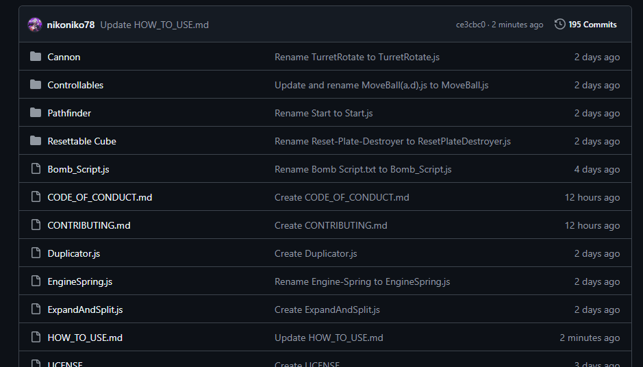 | 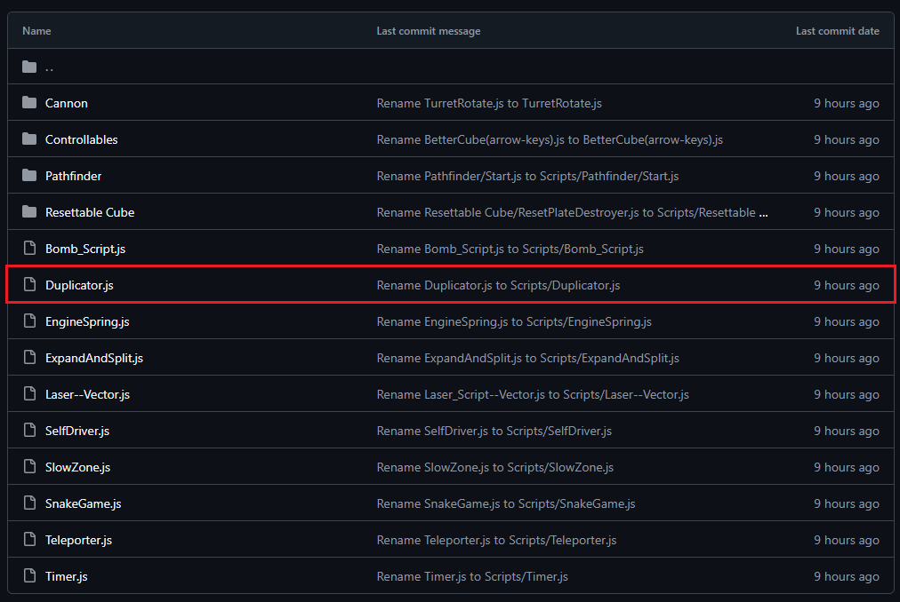 |
|-----------------------------------------|-----------------------------------------|
### Copy raw file.
| 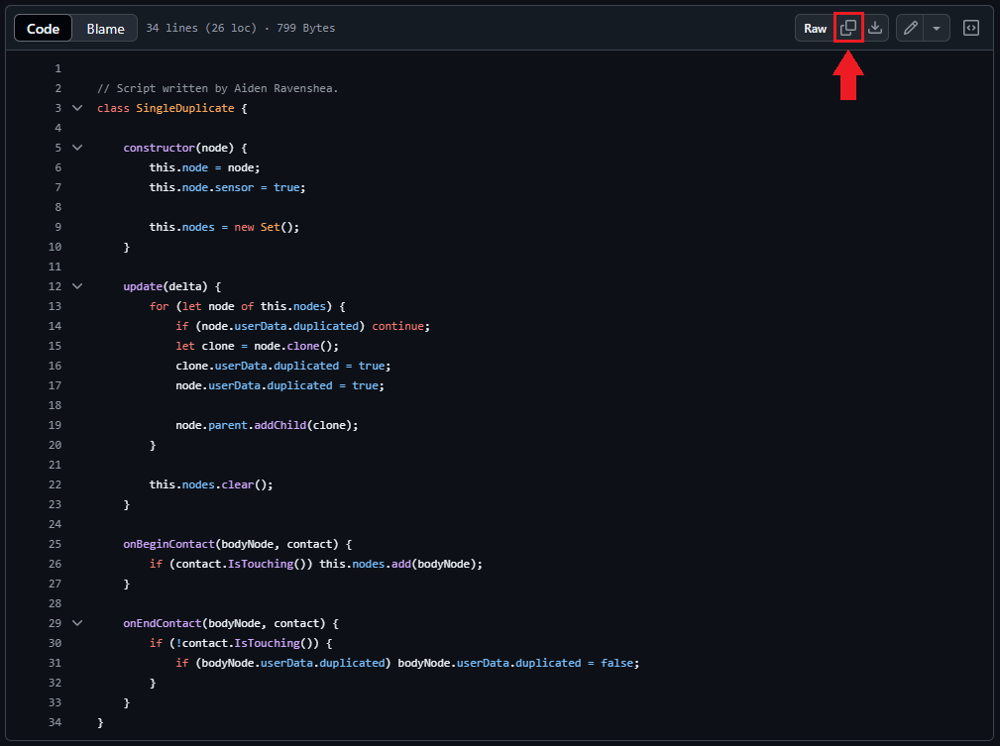 | 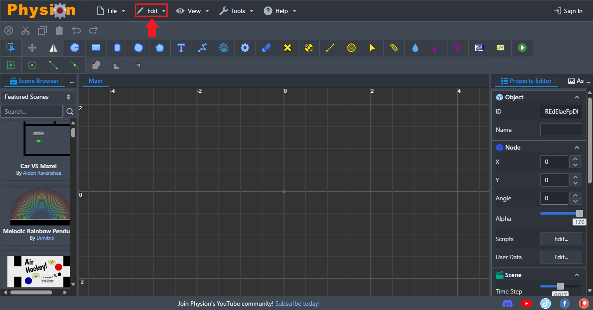 |
|-----------------------------------------|-----------------------------------------|
### Go to app.physion.net.
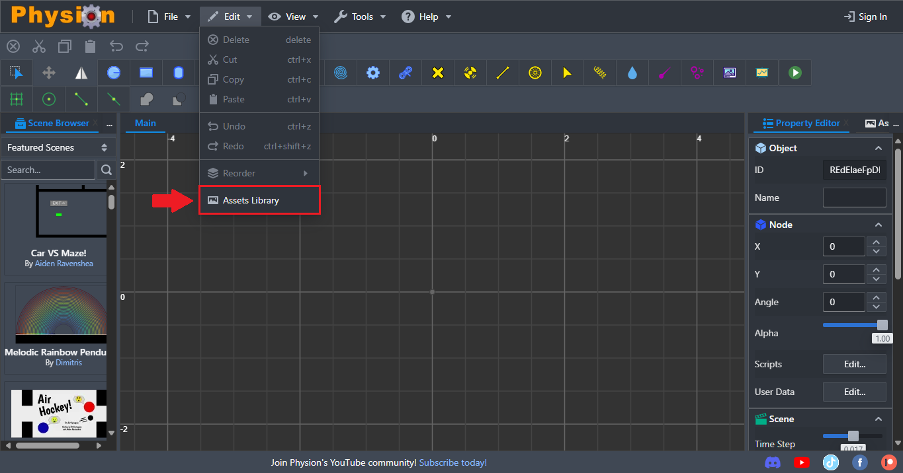
### Create a new scene.
|  | 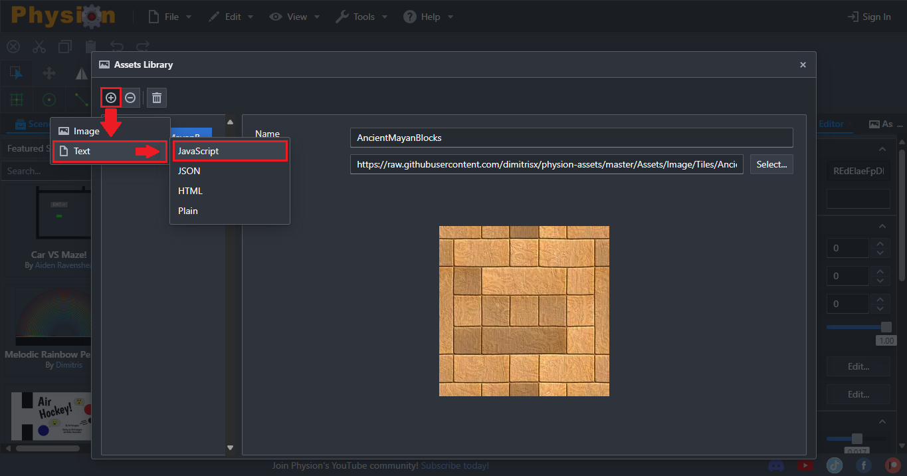 |
|-----------------------------------------|------------------------------------------|
### Open the Assets Library.
| 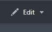 | 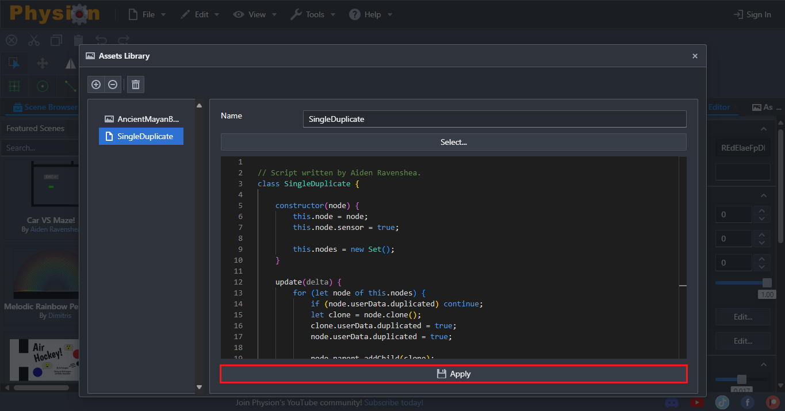 |
|------------------------------------------|------------------------------------------|
### Open a new script.
| 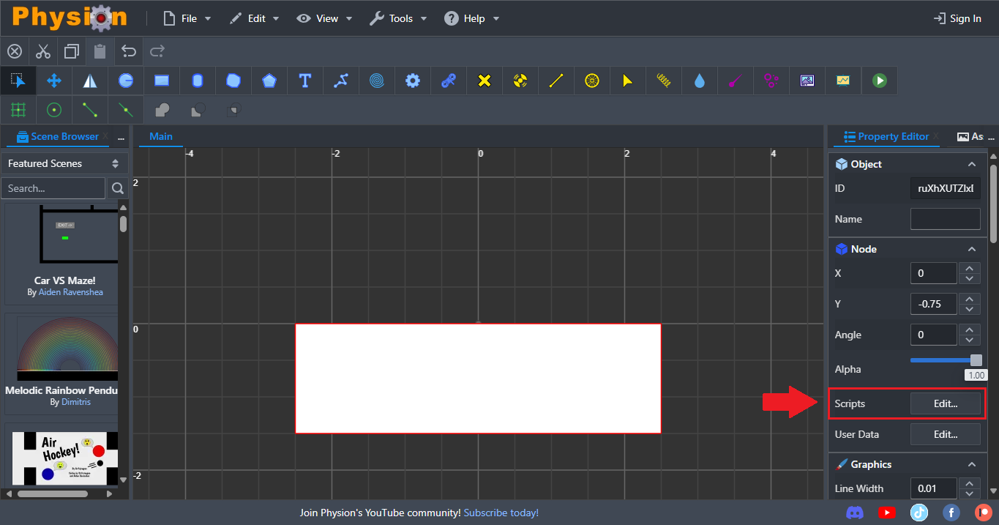 | 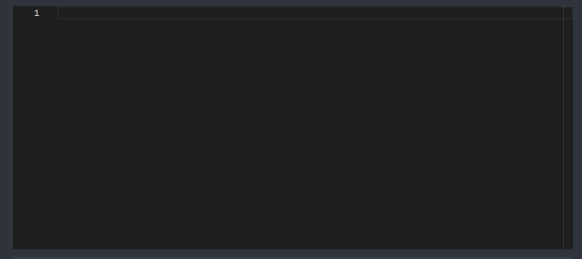 |
|------------------------------------------|------------------------------------------|
### Paste raw file.
| 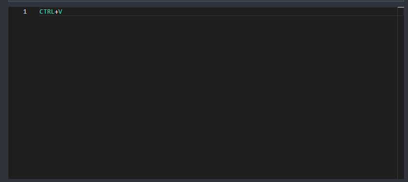 | 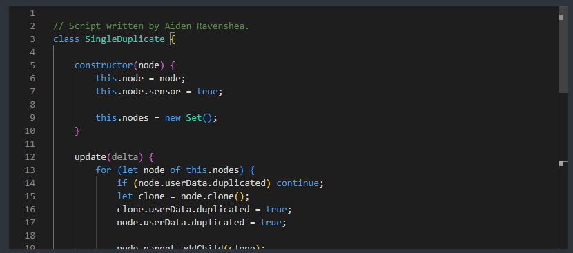 |
|------------------------------------------|------------------------------------------|
### Apply script.
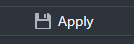
### Select desired node.
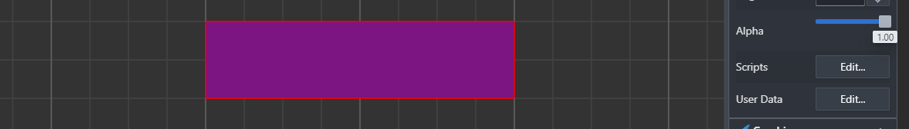
### Apply script to node.
| 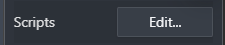 |  |  |
|------------------------------------------|------------------------------------------|------------------------------------------|
